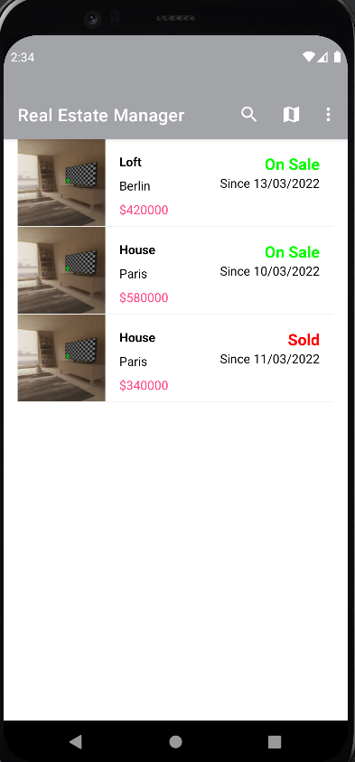
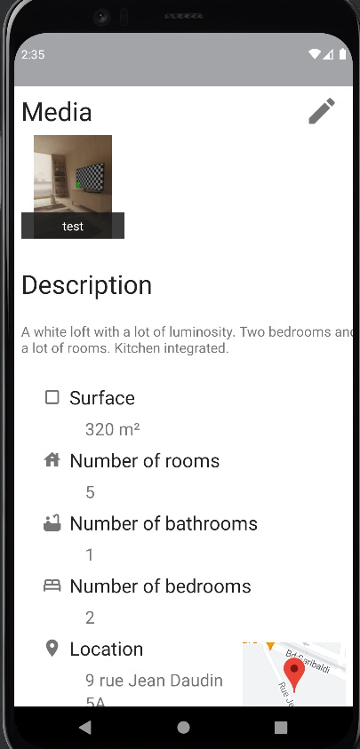
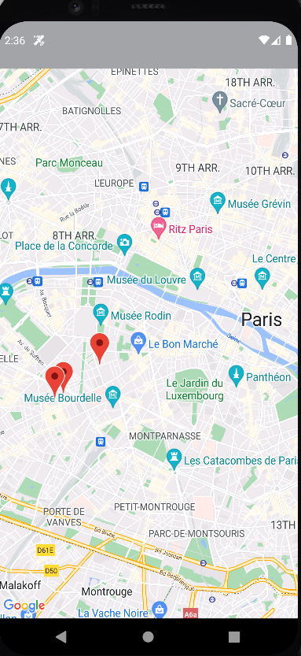
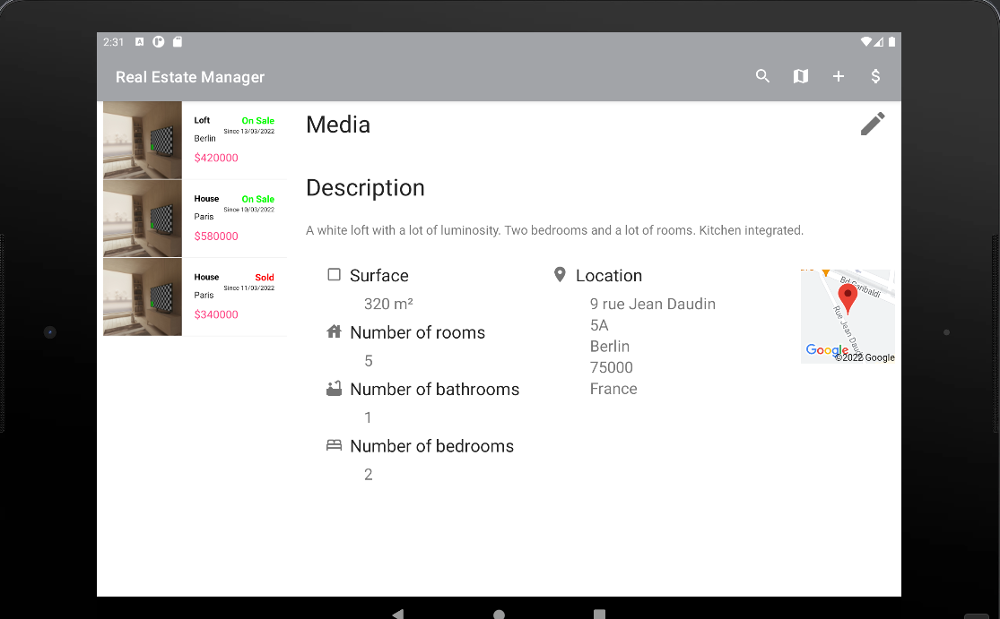

# RealEstateManager
An Android app that allows the user to store property for sale. The properties are stored on the device and can be access by the users. You can

- visualize all the properties in a list or on a map
- filter properties 
- add a property
- modify a property
- get a notification when you add a property

## Phone display
&ensp;

## Tablet display

## App Architecture
* MVVM
* Kotlin

## Library
* [Androidx Library](https://developer.android.com/jetpack/androidx)
* [Glide](https://github.com/bumptech/glide/)
* [Gson](https://github.com/google/gson/)
* [RobotElectric](https://github.com/robolectric/robolectric)
* [Easy Permissions](https://github.com/googlesamples/easypermissions)
* [Espresso](https://developer.android.com/training/testing/espresso)
* [Room Library](https://developer.android.com/topic/libraries/architecture/room)

## API
* [Google Maps API](https://developers.google.com/maps/documentation/android-sdk)
